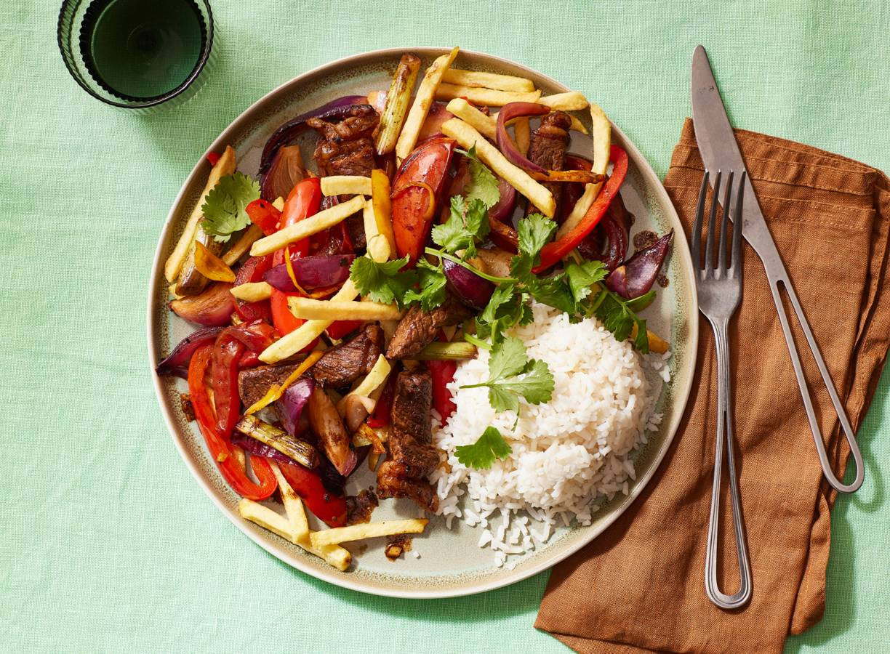

# LOMO SALTADO MET FRIET

## BENODIGHEDEN
* 400 g
    verse Franse friet
* 200 g
    witte rijst
* 300 g
    entrecotes
* 3 el
    sojasaus
* 2
    rode uien
* 3
    bosuitjes
* 2
    rode paprika's
* 2
    romatomaten
* 30 g
    verse gember
* ½
    Adjuma peper
* 2 el
    arachideolie
* 1 el
    wittewijnazijn
### BEREIDING
1. Verwarm de oven voor op 210 °C. Verdeel de friet over een met bakpapier beklede bakplaat en bak ze volgens de aanwijzingen op de verpakking goudgeel en krokant. Kook de rijst volgens de aanwijzingen op de verpakking.
2. Snijd de entrecote in plakken van 1 cm dik. Meng de helft van de sojasaus erdoor en laat staan tot gebruik.
3. Snijd ondertussen de uien in parten van 1 cm dik, de bosuitjes in stukken van 4 cm en de paprika’s in repen van 1 cm. Snijd de romatomaten in parten van 2 cm en verwijder de zaadlijsten.
4. Snijd de gember zo fijn mogelijk. Halveer de adjumapeper en verwijder de zaadlijsten. Snijd het vruchtvlees in de lengte in dunne repen. Houd je niet zo van pittig, gebruik dan een kwart peper.
5. Verhit de olie in een wok op hoog vuur en roerbak de entrecote 1-2 min. Haal met de schuimspaan uit de pan en leg op een bord. Bak de ui op hoog vuur 1 min. in het achtergebleven bakvet. Voeg de paprika, gember en adjuma-peper toe en bak nog 2 min. Voeg de entrecote (inclusief de uitgelopen sappen), de rest van de sojasaus, de tomaat en wittewijnazijn toe en roerbak nog 1-2 min.
6. Voeg de friet toe en schep kort om. Breng op smaak met peper en eventueel zout. Serveer direct, zodat de friet niet zompig wordt. Serveer met de rijst.

[linkadres recept](https://www.ah.nl/allerhande/recept/R-R1199202/lomo-saltado-met-friet)